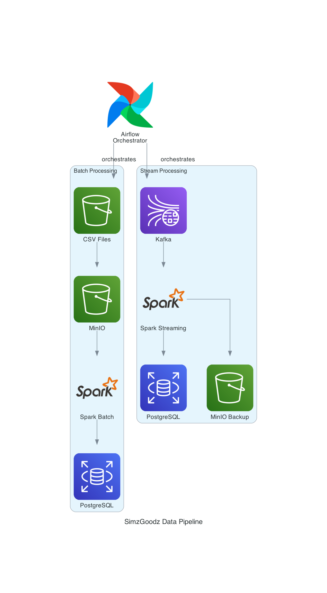

# Data Pipeline for sales streaming

Real-time retail data processing system using Apache Spark, Kafka, and Airflow.

## Architecture

- **Kafka**: Real-time data streaming
- **Spark**: Batch and stream processing  
- **PostgreSQL**: Data warehouse
- **MinIO**: Object storage
- **Airflow**: Workflow orchestration
- **Grafana**: Monitoring

## Quick Start

```bash
docker-compose up -d
```

Access:
- Airflow: http://localhost:8083
- Grafana: http://localhost:3000
- MinIO: http://localhost:9001

## Usage

1. **Batch Processing**: Run `SimzGoodz_batch_processing` DAG
2. **Stream Processing**: Run `SimzGoodz_live_streaming` DAG
3. **Stop Streaming**: Run `SimzGoodz_stop_streaming` DAG

## Architecture Diagram



**Data Flows:**
- **Batch**: CSV Files → MinIO → Spark → PostgreSQL
- **Stream**: Kafka → Spark Streaming → PostgreSQL + MinIO