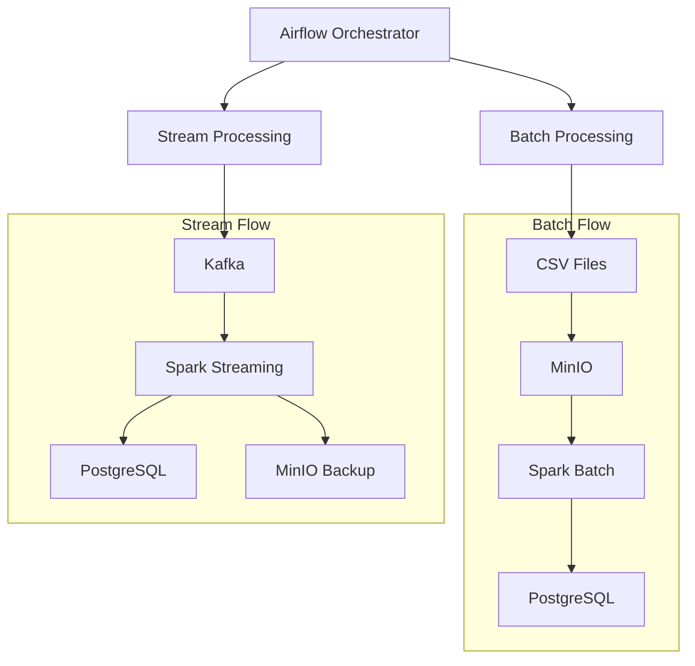

# Architecture Diagram

```mermaid
graph TD
    A[Airflow Orchestrator] --> B[Batch Processing]
    A --> C[Stream Processing]
    
    subgraph "Batch Flow"
        D[CSV Files] --> E[MinIO]
        E --> F[Spark Batch]
        F --> G[PostgreSQL]
    end
    
    subgraph "Stream Flow"
        H[Kafka] --> I[Spark Streaming]
        I --> J[PostgreSQL]
        I --> K[MinIO Backup]
    end
    
    B --> D
    C --> H
```